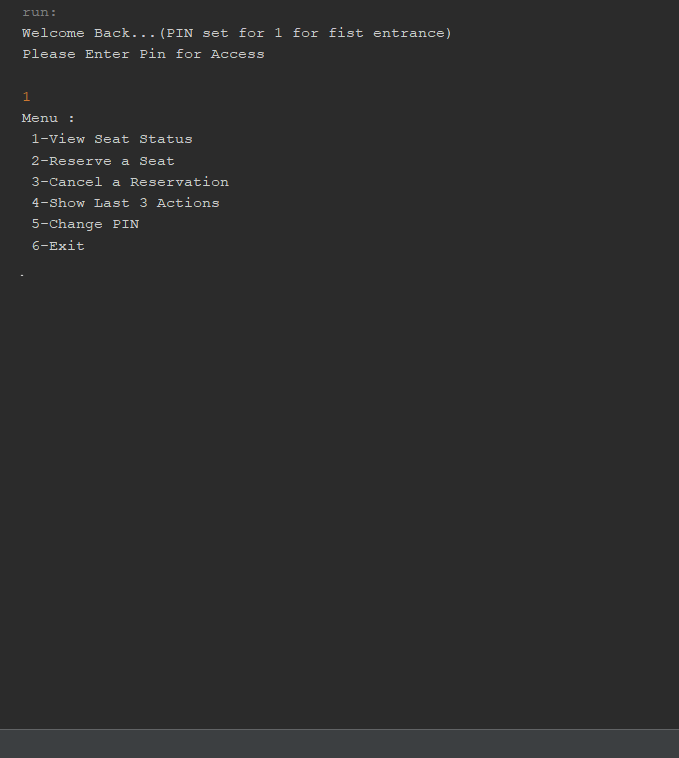

# java-cinema-system
Java console application for managing a single-user cinema system. Supports movie selection, ticket operations, and basic cinema workflow simulation.
## Screenshot

## Use Cases
This project can be adapted for:
- Programming assignments
- Student projects
- Console automation systems
